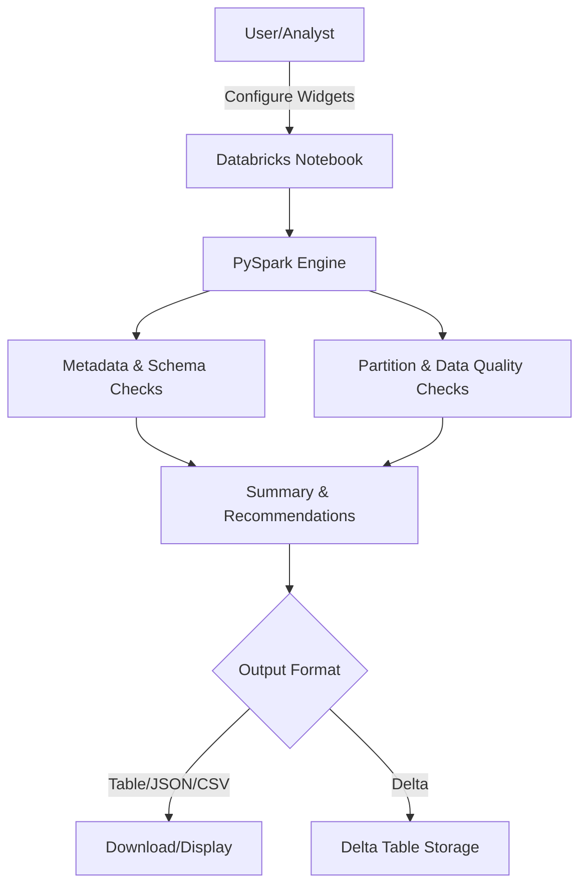

# Databricks Table Quality Assessment

<!-- Badges -->

  
  
  
  
  
  
  
  

# Databricks Table Quality Assessment

## General Description

This project provides an automated, scalable, and secure solution for large-scale table quality assessment in Databricks using native PySpark. It is designed to profile, validate, and report on the health of Delta and Parquet tables, focusing on metadata, schema, partitioning, and column-level data quality, without exposing raw data.

## General Architecture

- **Input**: List of fully qualified table names and configuration parameters (widgets)
- **Processing**: PySpark DataFrame transformations for metadata extraction, schema inspection, partition analysis, and column-level checks
- **Output**: Summary DataFrame with actionable recommendations, exportable in multiple formats (table, JSON, CSV, Delta)
- **Persistence**: Optional historical tracking via Delta table

## Component Diagram

## Deployment and Execution

1. Import the notebook into your Databricks workspace.
2. Attach to a cluster running Databricks Runtime 13.3+ with PySpark 3.x.
3. Configure the widgets at the top of the notebook (table list, scan partitions, output format, etc.).
4. Run all cells sequentially.
5. Review the results and export or persist as needed.

## Good Practices

- Use only fully qualified table names (catalog.schema.table)
- Avoid using collect(), show(), or toPandas() on large DataFrames
- Leverage partition filtering for large tables
- Cache intermediate results only when necessary and unpersist after use
- Use the Delta output format for historical tracking and trend analysis
- Review recommendations and adjust cluster/partitioning as suggested

## Licence and Contact

- **Licence:** Commons Clause + MIT / Apache 2.0
- **Author:**
  - [Jhonathan Pauca](mailto:jhonathan.pauca@unmsm.edu.pe), [jhonmetal](https://github.com/jhonmetal/)

---

## 📚 Usage Guide and Best Practices

### Level Requirement

**Intended User Level:** Junior to Intermediate

This notebook is designed for users with basic to moderate experience in PySpark and Databricks. No advanced engineering or deep Spark internals knowledge is required.

### How to Use This Notebook

1. **Configure Parameters**: Update the widgets at the top with your table list and preferences
2. **Run All Cells**: Execute cells sequentially to perform the complete assessment
3. **Review Results**: Analyze the displayed tables and recommendations
4. **Export Data**: Choose your preferred export format (table/JSON/CSV/Delta)
5. **Monitor Trends**: Historical data is saved for tracking quality over time

### Key Features

- **Scalable Processing**: Uses native PySpark for distributed computation
- **No Data Exposure**: Only metadata and summary statistics are analyzed
- **Comprehensive Checks**: Covers existence, size, schema, partitions, and data quality
- **Actionable Insights**: Provides specific recommendations for optimization
- **Historical Tracking**: Maintains assessment history for trend analysis

### Performance Optimization

- **Lazy Evaluation**: All transformations use lazy DataFrame operations
- **Resource Management**: Intermediate results are cached and unpersisted appropriately
- **Parallel Processing**: Table assessments can be distributed across cluster nodes
- **Adaptive Query Execution**: Spark AQE is enabled for optimal performance

### Data Quality Checks

- **Metadata Validation**: Table existence, size, and partition analysis
- **Schema Inspection**: Column types, counts, and structural validation
- **Content Quality**: Null ratios, illegal characters, string length validation
- **Integrity Checks**: Numeric ranges, infinite values, and consistency validation

### Recommendations Engine

The notebook provides actionable recommendations in the following categories:

- **CRITICAL**: Immediate attention required (missing tables, assessment failures)
- **PERFORMANCE**: Optimization opportunities (partitioning, cluster sizing)
- **DATA QUALITY**: Content issues (high null ratios, illegal characters)
- **OPTIMIZATION**: Best practice suggestions (table maintenance, structure)

### Troubleshooting

- **Permission Errors**: Ensure cluster has access to all specified catalogs/schemas
- **Memory Issues**: Reduce table list size or increase cluster memory
- **Timeout Issues**: Increase widget scan_partitions parameter
- **Schema Errors**: Verify table names are fully qualified (catalog.schema.table)

### Extending the Notebook

This notebook is designed to be modular and extensible:

- Add new quality checks by extending the `analyze_column_quality` function
- Implement custom recommendations in the `generate_recommendations` function
- Add new export formats by modifying the export section
- Integrate with external monitoring systems using the Delta table output

### Security and Privacy

- **No Raw Data Access**: Only metadata and aggregated statistics are processed
- **Secure Storage**: Results are stored in Delta format with ACID properties
- **Audit Trail**: All assessments are logged with timestamps and run IDs
- **Permission Respect**: Uses existing Spark security context

---

**For questions or support, contact the author [Jhonathan Pauca](mailto:jhonathan.pauca@unmsm.edu.pe), [jhonmetal](https://github.com/jhonmetal/).**